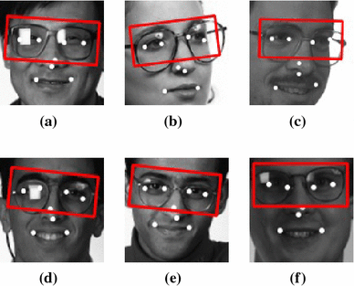

</a>

Data-Science-Portfolio: Raj

============================

This Portfolio is a compilation of all the Data Science and Data Analysis projects I have done for academic, self learning, and professional purposes. Presented in the form of Jupyter Notebooks, Google Colab Notebooks. 
 
It is updated on the regular basis.

<!-- For a more visually pleasant experience, Please check out my website [PrudhviRaj.com]() -->

- **Email**: [raj.numburi@gmail.com](raj.numburi@gmail.com)
- **LinkedIn**: [Linkedin.com/rajnumburi](https://www.linkedin.com/in/rajnumburi/)

  

<h1 align="center" style="background-color:Tomato;"> Case Studies in Deep Learning </h1>

  

## Case Study: [Low resource Language Translation using Machine Translation](https://github.com/PrudhviRaj-Numburi/Data_Science_Portfolio/tree/main/Projects/Language_Translator) 

The entire project will be based on the automatic language technique that is required for the translation between a high-resource (HRL) and a low resource language (LRL). The major problem of using LRL is the lack of parallel data. I have focused on Neural Machine Translation and determined its result with the help of TensorFlow, Keras and tokenization. The encoder-decoder model will be a part of this project. Several experiments will also be conducted in this project for creating a low language translator under NMT. The error of the process will also be analysed in the code. This project will also put light on more fields of study with the help of analysing previous researches under the subject area.
- <a href=""> Case Study Papers</a>
- <a href="https://github.com/PrudhviRaj-Numburi/Data_Science_Portfolio/tree/main/Projects/Language_Translator"> Github Repo</a>
- <a href="Projects/Language_Translator/Low_Resource_Language_Translation.ipynb"> Python Code</a>

## Case Study: [Object Detection using YOLO v5, PyTorch](https://github.com/PrudhviRaj-Numburi/Data_Science_Portfolio/tree/main/Projects/Glasses_Detection)

- **Objective:** To detect whether a person is wearing spectacles or not
- **Data:** For Image classification, data is extracted from the Kaggle website. Dataset link is given in the description. This data consists of 3060 images which consist of different people wearing eyewear and people without eyewear. This extracted data contains people having eyewear with a count of 1689. Alongside, 1371 images consist of people who are not wearing eyewear. These images that are not wearing eyewear is mixed with other data and used for training the model which makes the model more robust and have better accuracy when the new data comes in. 
- **Object Detection tool: Yolo v5** The data with eyewear is taken for labelling, As the system needs the labelled data to identify which specific part of the image to be analysed for object detection i.e., eyewear detection in my case. In object detection, for labelling the data I have used Computer Vision Annotation Tool (CVAT). CVAT is an open-source interactive online tool used for annotating images for computer vision algorithms.
- **Note:** For detailed explanation and plots open the Github Repo, the link is given below

- <a href="https://github.com/PrudhviRaj-Numburi/Data_Science_Portfolio/tree/main/Projects/Glasses_Detection/Research"> Case Study Papers</a>
- <a href="https://github.com/PrudhviRaj-Numburi/Data_Science_Portfolio/tree/main/Projects/Glasses_Detection"> Github Repo</a>
- <a href="https://github.com/PrudhviRaj-Numburi/Data_Science_Portfolio/tree/main/Projects/Glasses_Detection/Code"> Python Code</a>
- <a href="Projects/Glasses_Detection/Instructions.txt"> Instructions</a>

## Case Study: [Image Recognition](https://github.com/PrudhviRaj-Numburi/Data_Science_Portfolio/tree/main/Projects/Image-Recognition-Dog%2CCat)

**Objective:** To identify the class which an image belongs a Dog image class or a Cat image class.  
**Task:** Using 8K images of dogs and cats to train Convolutional Neural Network(CNN) to predict whether the image is a Dog or a Cat image. 
- <a href="Projects/Image-Recognition-Dog,Cat/Case-Study-Paper/Convolutional_Neural_Networks_Case_Study.pdf"> Case Study Papers</a>
- <a href="https://github.com/PrudhviRaj-Numburi/Data_Science_Portfolio/tree/main/Projects/Image-Recognition-Dog%2CCat"> Github Repo</a>
- <a href="Projects/Image-Recognition-Dog,Cat/Model/Artificial_Neural_Network_Case_Study.py"> Python Code</a>
 

<h1 align="center" style="background-color:Tomato;"> Projects in Machine Learning </h1>

  

## [Road Safety UK](https://github.com/PrudhviRaj-Numburi/Data_Science_Portfolio/tree/main/Projects/Road_Safety_UK)

This Project will use UK Road Safety open source data (2019). The dataset is published by Department of Transports, under Open Government Licence.The data consists of detailed road safety data about the circumstances of personal injury road accidents, the types of vehicles involved and the consequential casualties.
- **Note:** For detailed explanation and plots open the Github Repo
- <a href="https://github.com/PrudhviRaj-Numburi/Data_Science_Portfolio/tree/main/Projects/Road_Safety_UK"> Github Repo</a>
 

## [Loan Default Prediction](Projects/Loan-Default-Prediction-master/Loan_Default_Prediction.ipynb)

In this project I have applied various classification models such as Logistic Regression, Random Forest and LightGBM to detect consumers who will default the loan. SMOTE is used to combat class imbalance and LightGBM is implemented that resulted into the highest accuracy 98.89% and 0.99 F1 Score.
 
- <a href="https://github.com/PrudhviRaj-Numburi/Data_Science_Portfolio/tree/main/Projects/Loan-Default-Prediction-master"> Github Repo</a>
- <a href="Projects/Loan-Default-Prediction-master/Loan_Default_Prediction.ipynb"> Python Code</a>
 

## [Social Network Ads](Projects/Loan-Default-Prediction-master/Loan_Default_Prediction.ipynb)

Using K-NN (K-Nearest Neighbours) on a dataset [Social Network Ads.csv](Projects/Social_Network_Ads/Social_Network_Ads.csv) that tells us if a customer bought an SUV based on a social network ad or not.
 
- <a href="https://github.com/PrudhviRaj-Numburi/Data_Science_Portfolio/tree/main/Projects/Social_Network_Ads"> Github Repo</a>
- <a href="Projects/Loan-Default-Prediction-master/Loan_Default_Prediction.ipynb"> Python Code</a>
 

## [Demonetisation](Projects/Demonetisation/Demonetisation_Sentiment_Analysis.ipynb)

### Sentiment Analysis 
The Government of India announced the demonetisation of all ₹500 and ₹1000 banknotes, using kaggle dataset of [tweets](Projects/Demonetisation/demonetization-tweets.csv) during demonetisation is used to analysis sentiments.
 

- <a href="https://github.com/PrudhviRaj-Numburi/Data_Science_Portfolio/tree/main/Projects/Demonetisation"> Github Repo</a>
- <a href="Projects/Demonetisation/Demonetisation_Sentiment_Analysis.ipynb"> Python Code</a>
 

## [World University Rankings](Projects/World_ranking_Universities/World_University_Ranking_Analaysis_with_Plotly.pdf)

The whole project is on Plot.ly library
 

- <a href="https://github.com/PrudhviRaj-Numburi/Data_Science_Portfolio/tree/main/Projects/World_ranking_Universities"> Github Repo</a>
- <a href="Projects/World_ranking_Universities/Plotly_WIDS.ipynb"> Python Code</a>
 
 

<h1 align="center" style="background-color:Tomato;"> Data Science App </h1>

 
To access this app: [Click here](https://dataappsolution.herokuapp.com/)
 
  
This app will perform Automatic Data Analysis on any dataset. You have an option to upload your own dataset. Using this app we can perform a fast EDA analysis on any dataset. For trail purpose an example CSV is provided in the app.
 
 
 
## Note:
This solution do not substitute a more deeper analysis of your dataset. Because there is no treatment of the missing values, duplicated values and also problematic information on the columns. The main goal is to give a quicker overview of the contained information inside the dataset. 
  
   
<h1 align="center" style="background-color:Tomato;"> Core Competencies </h1>

- **Methodologies**: Machine Leaning, Deep Learning, Computer Vision, Data Analysis, Natural Language Processing, Statistics, Time Series Analysis, Data Visualisation A/B Testing, Big Data, SQL
- **Languages**: Python(Pandas, Numpy, Scipy, Matplotlib, Seaborn, Sckit-learn, Tensorflow, Keras, PyTorch, OpenCV), C++, MATLAB, Arduino
- **Tools**: MySQL, Tableau, Git, AWS(Amazon Web Services), Azure, MS Excel 
