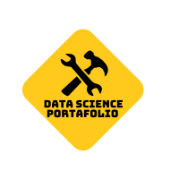
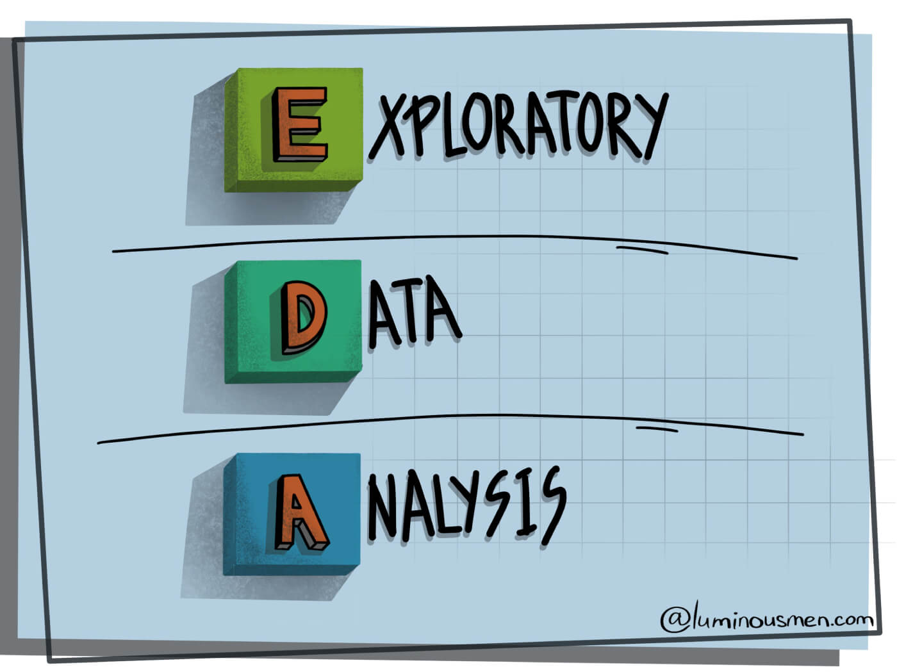

</a>

Data-Science-Portfolio:fire: - Prudhvi Raj
============================
This Portfolio is a compilation of all the Data Science and Data Analysis projects I have done for academic, self learning, and professional purposes. Presented in the form of Jupyter Notebooks. It is updated on the regular basis.

For a more visually pleasant experience, Please check out my website [PrudhviRaj.com]()

- **Email**: [prudhviraj.numburi@gmail.com](prudhviraj.numburi@gmail.com)
- **LinkedIn**: [Linkedin.com/prudhvirajnumburi](www.linkedin.com/in/prudhvirajnumburi)

  

<h1 align="center" style="background-color:Tomato;"> Case Studies in Deep Learning </h1>

  

## Case Study: [Low resource Language Translation](Projects/Language_Translator/Low_Resource_Language_Translation.ipynb) 

In this project I have used transformers in tensorflow, This Portfolio is a compilation of all the Data Science and Data Analysis projects I have done for academic, self learning, and professional purposes. Presented in the form of Jupyter Notebooks. It is updated on the regular basis. This Portfolio is a compilation of all the Data Science and Data Analysis projects I have done for academic, self learning, and professional purposes. Presented in the form of Jupyter Notebooks. It is updated on the regular basis. This Portfolio is a compilation of all the Data Science and Data Analysis projects I have done for academic, self learning, and professional purposes. Presented in the form of Jupyter Notebooks.
- <a href=""> Case Study Papers</a>
- <a href="https://github.com/PrudhviRaj-Numburi/Data_Science_Portfolio/tree/main/Projects/Language_Translator"> Github Repo</a>
- <a href="Projects/Language_Translator/Low_Resource_Language_Translation.ipynb"> Python Code</a>

## Case Study: [Object Detection using CNN, YOLO v5](https://github.com/PrudhviRaj-Numburi/Data_Science_Portfolio/tree/main/Projects/Glasses_Detection/Code)

In this project I have used transformers in tensorflow, This Portfolio is a compilation of all the Data Science and Data Analysis projects I have done for academic, self learning, and professional purposes. Presented in the form of Jupyter Notebooks. It is updated on the regular basis. This Portfolio is a compilation of all the Data Science and Data Analysis projects I have done for academic, self learning, and professional purposes. Presented in the form of Jupyter Notebooks. It is updated on the regular basis. This Portfolio is a compilation of all the Data Science and Data Analysis projects I have done for academic, self learning, and professional purposes. Presented in the form of Jupyter Notebooks.
- <a href="https://github.com/PrudhviRaj-Numburi/Data_Science_Portfolio/tree/main/Projects/Glasses_Detection/Research"> Case Study Papers</a>
- <a href="https://github.com/PrudhviRaj-Numburi/Data_Science_Portfolio/tree/main/Projects/Glasses_Detection"> Github Repo</a>
- <a href="https://github.com/PrudhviRaj-Numburi/Data_Science_Portfolio/tree/main/Projects/Glasses_Detection/Code"> Python Code</a>

## Case Study: [Image Recognition](Projects/Image-Recognition-Dog,Cat/Model/Artificial_Neural_Network_Case_Study.py)

**Objective:** To identify the class which an image belongs a Dog image class or a Cat image class.  
**Task:** Using 8K images of dogs and cats to train Convolutional Neural Network(CNN) to predict whether the input image is a Dog image or a Cat image.
 
 
 

- <a href="Projects/Image-Recognition-Dog,Cat/Case-Study-Paper/Convolutional_Neural_Networks_Case_Study.pdf"> Case Study Papers</a>
- <a href="https://github.com/PrudhviRaj-Numburi/Data_Science_Portfolio/tree/main/Projects/Image-Recognition-Dog%2CCat"> Github Repo</a>
- <a href="Projects/Image-Recognition-Dog,Cat/Model/Artificial_Neural_Network_Case_Study.py"> Python Code</a>

<h1 align="center" style="background-color:Tomato;"> Projects in Machine Learning </h1>

  

## [Loan Default Prediction](Projects/Loan-Default-Prediction-master/Loan_Default_Prediction.ipynb)

In this project I applied various classification models such as Logistic Regression, Random Forest and LightGBM to detect consumers who will default the loan. SMOTE is used to combat class imbalance and LightGBM is implemented that resulted into the highest accuracy 98.89% and 0.99 F1 Score.
 
- <a href="https://github.com/PrudhviRaj-Numburi/Data_Science_Portfolio/tree/main/Projects/Loan-Default-Prediction-master"> Github Repo</a>
- <a href="Projects/Loan-Default-Prediction-master/Loan_Default_Prediction.ipynb"> Python Code</a>
 

## [Social Network Ads](Projects/Loan-Default-Prediction-master/Loan_Default_Prediction.ipynb)

Using K-NN (K-Nearest Neighbours) on a dataset [Social Network Ads.csv](Projects/Social_Network_Ads/Social_Network_Ads.csv) that tells us if a customer bought an SUV based on a social network ad or not.
 
- <a href="https://github.com/PrudhviRaj-Numburi/Data_Science_Portfolio/tree/main/Projects/Social_Network_Ads"> Github Repo</a>
- <a href="Projects/Loan-Default-Prediction-master/Loan_Default_Prediction.ipynb"> Python Code</a>
 

## [Demonetisation](Projects/Demonetisation/Demonetisation_Sentiment_Analysis.ipynb)

### Sentiment Analysis 
The Government of India announced the demonetisation of all ₹500 and ₹1000 banknotes, using kaggle dataset of [tweets](Projects/Demonetisation/demonetization-tweets.csv) during demonetisation is used to analysis sentiments.
 

- <a href="https://github.com/PrudhviRaj-Numburi/Data_Science_Portfolio/tree/main/Projects/Demonetisation"> Github Repo</a>
- <a href="Projects/Demonetisation/Demonetisation_Sentiment_Analysis.ipynb"> Python Code</a>
 

## [World University Rankings](Projects/World_ranking_Universities/World_University_Ranking_Analaysis_with_Plotly.pdf)

The whole project is on Plot.ly library
 

- <a href="https://github.com/PrudhviRaj-Numburi/Data_Science_Portfolio/tree/main/Projects/World_ranking_Universities"> Github Repo</a>
- <a href="Projects/World_ranking_Universities/Plotly_WIDS.ipynb"> Python Code</a>
 

<h1 align="center" style="background-color:Tomato;"> Data Science App </h1>

 
To access this app: [Click here](https://dataappsolution.herokuapp.com/)
 
  
This app will perform Automatic Data Analysis on any dataset. You have an option to upload your own dataset. Using this app we can perform a fast EDA analysis on any dataset. For trail purpose an example CSV is provided in the app.
 
 
 
## Note:
This solution do not substitute a more deeper analysis of your dataset. Because there is no treatment of the missing values, duplicated values and also problematic information on the columns. The main goal is to give a quicker overview of the contained information inside the dataset. 
  
<h1 align="center" style="background-color:Tomato;"> Core Competencies </h1>

- **Methodologies**: Machine Leaning, Deep Learning, Computer Vision, Data Analysis, Natural Language Processing, Statistics, Time Series Analysis, Data Visualisation A/B Testing, Big Data, SQL
- **Languages**: Python(Pandas, Numpy, Scipy, Matplotlib, Seaborn, Sckit-learn, Tensorflow, Keras, OpenCV), C++, MATLAB, Arduino
- **Tools**: MySQL, Tableau, Git, AWS(Amazon Web Services), Azure, MS Excel 
